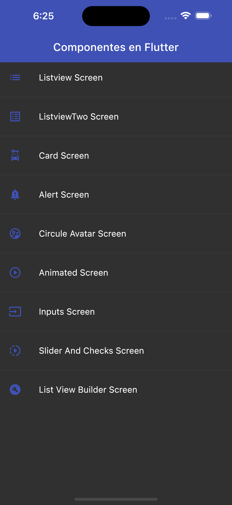
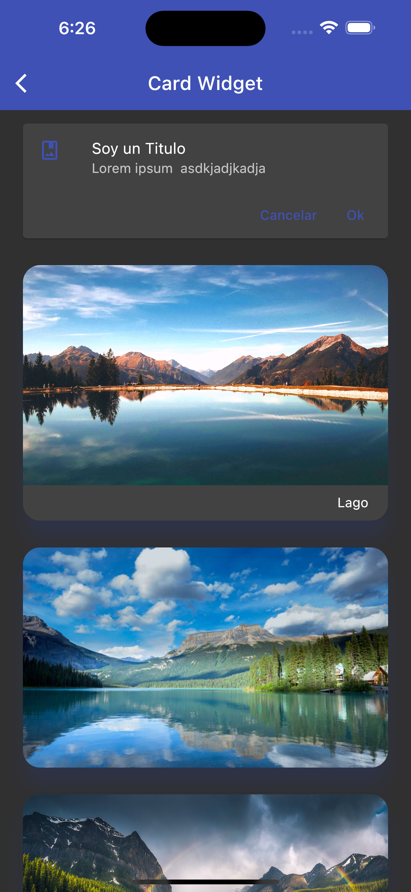
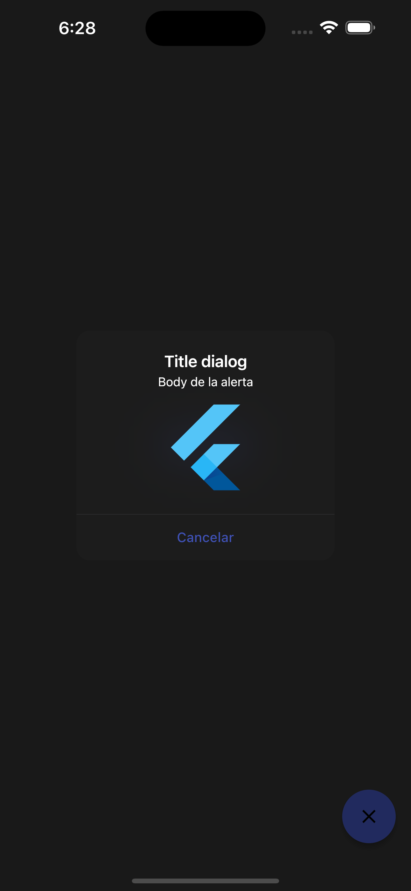
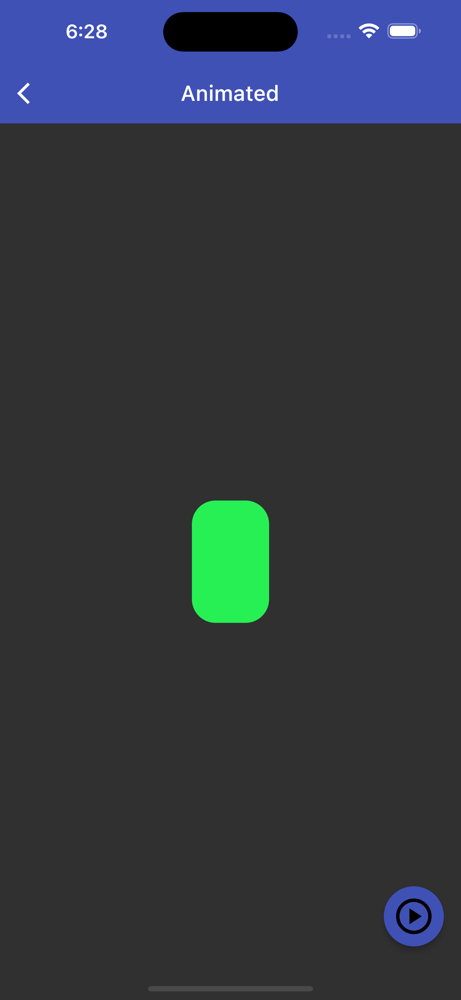
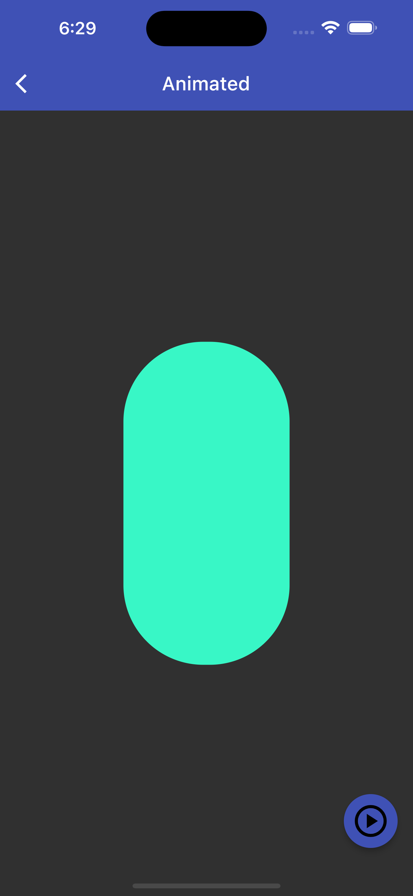
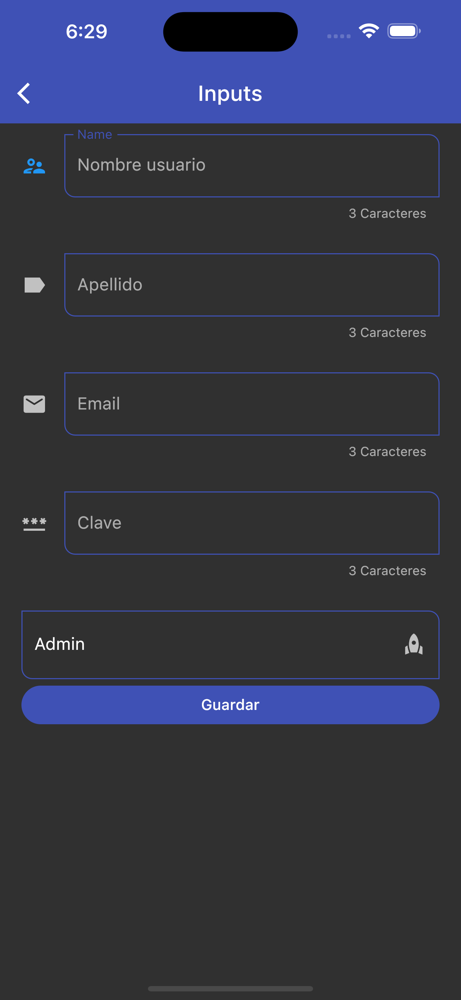
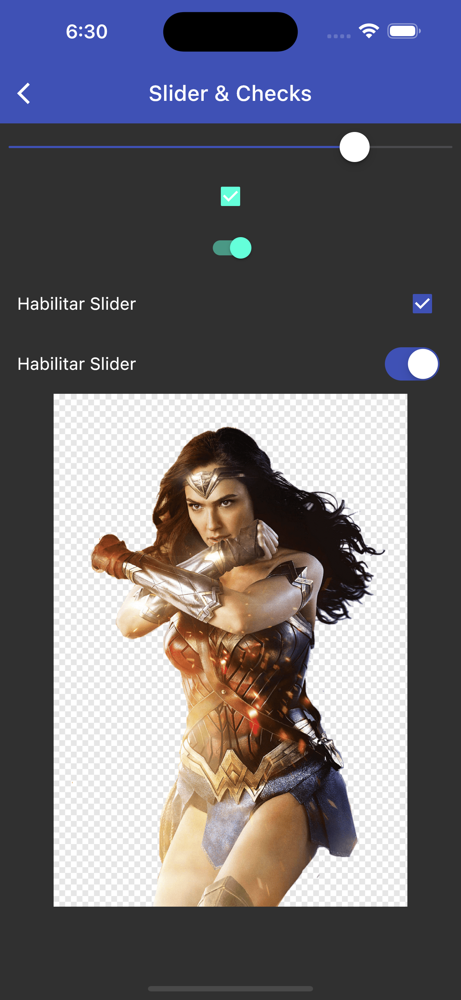

# flutter_components

Modulo de componentes para  el curso de fluter

La visualizacion de los siguientes componentes

## IOS

```shell
Iphone 15 Pro Max
IOS 17.0
```

## Home


## Listview


## Listview Two


## Cards


## Alert


## Avatar


## Animated


## Animated Two


## Inputs


## Slider


## Lisview Builder
